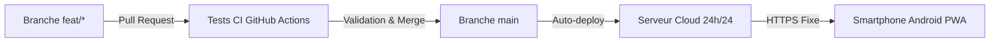

# Guide de Déploiement Cloud 24h/24 & CI/CD Automatisé

Ce guide vous accompagne pas-à-pas pour rendre votre **Personal Assistant Hub** accessible **24h/24 et 7j/7**, même lorsque votre ordinateur est éteint, avec **déploiement automatique à chaque Merge Request (MR) / Pull Request fusionnée dans `main`**.

---

## 🌟 Vue d'ensemble du Fonctionnement

```mermaid
flowchart LR
    A[Branche feat/*] -->|Pull Request| B[Tests CI GitHub Actions]
    B -->|Validation & Merge| C[Branche main]
    C -->|Auto-deploy| D[Serveur Cloud 24h/24]
    D -->|HTTPS Fixe| E[Smartphone Android PWA]
```

1. Vous développez et testez sereinement sur votre branche de feature.
2. Lorsque vous fusionnez votre PR vers `main`, GitHub Actions lance la suite de tests automatisés.
3. Si tous les tests sont à 100% au vert, le conteneur Docker est automatiquement déployé sur le Cloud.
4. Votre smartphone reçoit la mise à jour de façon transparente dès sa prochaine ouverture !

---

## 🔑 Étape 1 : Préparer vos Secrets dans GitHub

Pour que le serveur Cloud puisse dialoguer avec votre Google Sheets sans risquer de divulguer vos clés dans le code public, les identifiants sont stockés dans les **GitHub Secrets** de votre dépôt :

1. Rendez-vous sur votre dépôt GitHub : `https://github.com/Alexisleveque-OC/personal-assistant-hub`
2. Cliquez sur l'onglet **Settings** (en haut à droite du dépôt).
3. Dans le menu de gauche, allez dans **Secrets and variables** > **Actions**.
4. Cliquez sur le bouton vert **New repository secret** pour ajouter vos variables :

| Nom du Secret | Description | Exemple de valeur |
| :--- | :--- | :--- |
| `API_KEY` | Clé d'API secrète pour verrouiller l'accès mobile | `votre_cle_secrete_1234` |
| `SPREADSHEET_MEALS_SHOPPING_ID` | Identifiant du classeur Repas & Courses (visible dans l'URL de votre sheet) | `1a2b3c4d5e_EXEMPLE_ID_CLASSEUR_VOTRE_SHEET` |
| `SPREADSHEET_SPORT_ID` | Identifiant du classeur Sport Running / Otis (partagé avec le Service Account) | `1f2g3h4i5j_EXEMPLE_ID_CLASSEUR_SPORT` |
| `SPREADSHEET_BUDGET_ID` | Identifiant du classeur Budget Mensuel (optionnel) | `1k2l3m4n5o_EXEMPLE_ID_CLASSEUR_BUDGET` |
| `GOOGLE_SERVICE_ACCOUNT_INFO` | Contenu intégral de votre fichier `credentials.json` | `{"type": "service_account", ...}` |
| `GEMINI_API_KEY` | Clé d'API Google AI Studio pour le moteur conversationnel Gemini Flash | `AIzaSy...` |
| `LITESTREAM_REPLICA_URL` | URL de réplication du bucket Cloud pour SQLite (GCS, S3, R2) | `gcs://nom-de-votre-bucket/hub_data.db` |

> [!IMPORTANT]
> **Partage Google Sheets obligatoire :**
> Vos classeurs Google Sheets (`SPREADSHEET_MEALS_SHOPPING_ID`, `SPREADSHEET_SPORT_ID`, etc.) doivent impérativement être **partagés en Éditeur** avec l'adresse email de votre compte de service Google (le champ `"client_email"` présent dans votre `credentials.json` / `GOOGLE_SERVICE_ACCOUNT_INFO`).

> [!TIP]
> **Astuce pour `GOOGLE_SERVICE_ACCOUNT_INFO` :**
> Vous pouvez ouvrir votre fichier `credentials.json` local, tout copier et le coller directement dans la valeur du secret GitHub. Le connecteur gère le format JSON brut ou encodé en base64 de manière 100% transparente.

---

## ☁️ Étape 2 : Choisir votre Plateforme Cloud

Deux options s'offrent à vous : **Google Cloud Run** (inclus dans l'écosystème Google avec plan gratuit permanent) ou **Render** (mise en place en 2 clics).

---

### Option A : Google Cloud Run (100% Google, 0€/mois)

Google Cloud Run offre un **niveau gratuit permanent de 2 millions de requêtes par mois**, idéal pour un usage personnel.

1. **Activer les APIs nécessaires sur Google Cloud :**
   * Rendez-vous sur la [Console Google Cloud](https://console.cloud.google.com/).
   * Sélectionnez le projet Google associé à vos identifiants Google Sheets.
   * Dans la barre de recherche ou sous **APIs & Services** > **Bibliothèque**, vérifiez que les APIs suivantes sont **activées** :
     - **Cloud Run Admin API**
     - **Cloud Build API** (requis pour compiler l'image depuis le code source)
     - **Artifact Registry API** (requis pour stocker l'image du conteneur)
     - **Cloud Storage API** (requis pour téléverser les sources de build)

2. **Créer le compte de service `github-deployer` avec les rôles IAM complets :**
   * Allez dans **IAM & Administration** > **IAM**.
   * Localisez (ou créez dans **Comptes de service**) le compte `github-deployer@<PROJECT_ID>.iam.gserviceaccount.com`.
   * Attribuez-lui (ou ajoutez-lui via le bouton Modifier) les 5 rôles indispensables :
     * **Administrateur Cloud Run** (`roles/run.admin`)
     * **Administrateur de stockage** (`roles/storage.admin`) *(évite l'erreur storage.buckets.get sur les run-sources)*
     * **Éditeur Cloud Build** (`roles/cloudbuild.builds.editor`)
     * **Administrateur Artifact Registry** (`roles/artifactregistry.admin`)
     * **Utilisateur de compte de service** (`roles/iam.serviceAccountUser`)
   * Allez dans l'onglet **Clés** de ce compte de service > **Ajouter une clé** > **Créer une clé au format JSON** et téléchargez-la.

3. **Ajouter les secrets GCP dans GitHub :**
   * `GCP_PROJECT_ID` : L'identifiant de votre projet Google Cloud (ex: `personal-assistant-hub-123456`).
   * `GCP_SA_KEY` : Le contenu du fichier JSON de clé téléchargé ci-dessus.
   * `GCP_REGION` : `europe-west1` (Belgique) ou `europe-west9` (Paris).

4. **Créer le Bucket de persistance SQLite (Litestream - 100% Gratuit) :**
   * Dans la console Google Cloud > **Cloud Storage** > **Buckets** > **Créer**.
   * Nom du bucket : ex `personal-assistant-hub-data-<votre-nom>` (doit être unique mondialement).
   * Donnez le rôle **Administrateur des objets de stockage** (`Storage Object Admin`) :
     - À l'adresse email de votre compte de service `GOOGLE_SERVICE_ACCOUNT_INFO` (visible dans votre `credentials.json`, ex: `...@...iam.gserviceaccount.com`).
     - Et au compte de service Cloud Run par défaut (`<PROJECT_NUMBER>-compute@developer.gserviceaccount.com`).
   * Ajoutez le secret GitHub : `LITESTREAM_REPLICA_URL=gcs://nom-du-bucket/hub_data.db`.

*Dès lors, chaque merge vers `main` déploiera votre conteneur avec `--no-cpu-throttling` (Gen2) et réplication continue Litestream 24h/24 sans perte de données !*

---

### Option B : Render (Alternative en 2 clics zéro configuration GCP)

Si vous souhaitez la solution la plus rapide sans configurer les rôles IAM de Google Cloud :

1. Créez un compte gratuit sur [render.com](https://render.com) en vous connectant avec votre compte **GitHub**.
2. Cliquez sur **New +** > **Web Service**.
3. Choisissez votre dépôt **`Alexisleveque-OC/personal-assistant-hub`**.
4. Render détecte automatiquement le `Dockerfile` à la racine :
   * **Name :** `personal-assistant-hub`
   * **Region :** `Frankfurt (EU Central)`
   * **Instance Type :** `Free`
5. Dans la section **Environment Variables**, ajoutez :
   * `API_KEY` : Votre clé secrète.
   * `SPREADSHEET_MEALS_SHOPPING_ID` : L'ID de votre Google Sheet repas/courses.
   * `SPREADSHEET_SPORT_ID` : L'ID de votre Google Sheet sport running.
   * `GOOGLE_SERVICE_ACCOUNT_INFO` : Le contenu de votre `credentials.json`.
   * `GEMINI_API_KEY` : Votre clé Gemini (optionnel).
6. Cliquez sur **Create Web Service**.
7. Dans les paramètres Render (**Settings**), copiez votre **Deploy Hook URL** et ajoutez-le dans vos secrets GitHub sous le nom :
   * `RENDER_DEPLOY_HOOK`

*Dès lors, à chaque merge vers `main`, GitHub Actions appellera ce webhook et Render mettra à jour votre serveur en moins de 60 secondes !*

---

## 📱 Étape 3 : Installation sur votre Smartphone

Dès que votre serveur Cloud est en ligne (vous disposerez d'une adresse HTTPS permanente, par exemple `https://mon-assistant.a.run.app/app` ou `https://personal-assistant-hub.onrender.com/app`) :

1. Ouvrez l'adresse dans **Google Chrome** sur votre smartphone.
2. Touchez l'icône **Paramètres ⚙️** en haut à droite et renseignez votre `API_KEY` une seule fois.
3. Touchez les **3 points ⋮** de Chrome > **« Ajouter à l'écran d'accueil »** (ou *« Installer l'application »*).
4. Votre application s'installe avec son icône Monstera.

> [!NOTE]
> Désormais, vous pouvez éteindre complètement votre ordinateur : votre assistant personnel reste accessible **24h/24** au supermarché comme à la maison, et se mettra à jour automatiquement à chaque amélioration de votre code !
